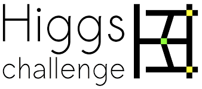

# Higgs Boson Machine Learning Challenge

**Student:** Zane Coons  
**Date:** May 1, 2026  

---



## Project Overview

This project applies a Gradient Boosting Classifier (GBC) to the [Higgs Boson Machine Learning Challenge](https://www.kaggle.com/competitions/higgs-boson), the Kaggle competition organized in 2014 by CERN's ATLAS experiment. The task is a binary classification problem: given simulated particle collision event data, predict whether an event corresponds to a genuine Higgs boson decay signal (`s`) or background noise (`b`). 

The official evaluation metric is the Approximate Median Significance (AMS), a physics-motivated score that rewards correctly identifying signal events while heavily penalizing false positives.

$$\text{AMS} = \sqrt{2 \left[ (s + b + b_{\text{reg}}) \ln\left(1 + \frac{s}{b + b_{\text{reg}}}\right) - s \right]}$$

Where:
- **s** = sum of weights of correctly predicted signal events (true positives)
- **b** = sum of weights of incorrectly predicted background events (false positives)
- **b_reg = 10** = regularization constant

The dataset is permanently hosted at the [CERN Open Data Portal](https://opendata.cern.ch/record/328).

---

## Repository Structure

```
-> HiggsBosonKaggle.ipynb       # Main project notebook
-> submission.csv               # Final Kaggle submission file
-> training.csv                 # Training data (download from Kaggle)
-> test.csv                     # Test data (download from Kaggle)
-> HiggsBosonCompetition_AMSMetric_rev1.py  # Official scoring script (from Kaggle)
-> README.md                    # This file
```

> **Note:** `training.csv` and `test.csv` are not included in this repository due to file size. Download them from the [Kaggle competition data page](https://www.kaggle.com/competitions/higgs-boson/data) and place them in the same directory as the notebook before running. Additionally, `HiggsBosonCompetition_AMSMetric_rev1.py` is outdated and uses python 2, all AMS calculations are handled in the `HiggsBosonKaggle.ipynb` itself.

---

## Dataset

| File           | Rows    | Description                                                                       |
| -------------- | ------- | --------------------------------------------------------------------------------- |
| `training.csv` | 250,000 | Labeled events with physics features, event weights, and signal/background labels |
| `test.csv`     | 550,000 | Unlabeled events for final submission                                             |

Each event has 30 physics features split into derived features (`DER_...`) computed by ATLAS physicists, and primitive features (`PRI_...`) which are raw detector measurements. Missing values are encoded as `-999.0` and arise structurally when certain quantities are physically undefined (e.g., jet-related features when no jets are detected).

---

## Notebook Sections

### 1. Define Project
Full description of the Higgs boson discovery, the H -> $\tau\tau$ decay channel, the three background processes, the dataset structure, and a detailed explanation of the AMS metric including its formula and submission format requirements.

### 2. Data Loading and Initial Look
- Loads both datasets and confirms shapes
- Identifies and counts missing values (11 features, originally encoded as -999.0)
- Builds a complete feature summary table (type, range, missing count, outliers)
- Visualizes missing value distribution
- Analyzes class imbalance (34.27% signal, 65.73% background)
- Demonstrates target encoding (`s` → 1, `b` → 0)

### 3. Data Visualization
- Overlapping density histograms for all 30 features comparing signal vs background
- Categorical analysis of `PRI_jet_num` via frequency table and grouped bar charts
- Correlation heatmap across all continuous features
- Quantified separation analysis using histogram overlap coefficients
- Written observations identifying strong, moderate, and weak separating features

### 4. Data Cleaning and Preparation
Six cleaning steps applied in order, fitted on training data only:
1. Target encoding
2. Missingness indicator flags (before imputation)
3. Median imputation
4. Outlier clipping (1st/99th percentile)
5. One-hot encoding of `PRI_jet_num`
6. StandardScaler normalization (shape preserved, only scale changes)

Before vs after visualization for six representative features.

### 5. Machine Learning
- Final feature matrix: 44 features (29 continuous + 4 OHE + 11 missingness flags)
- 70/15/15 stratified train/validation/holdout split
- Physics-weighted sample weights to address class imbalance
- GradientBoostingClassifier training (300 estimators, depth 5)
- Validation via accuracy, ROC-AUC, and AMS with threshold sweep
- Confusion matrix, ROC curve, and AMS vs threshold plots
- Feature importance chart
- Hold-out evaluation for unbiased generalization estimate
- Submission file generation and format validation

---

#### Further info on Section 5 below

### Feature Matrix
The final feature matrix contains 44 features built from the original 30 physics features through three groups:

- **29 continuous features** --- the original physics measurements (DER_* and PRI_* excluding PRI_jet_num), standardized to zero mean and unit variance using StandardScaler
- **4 one-hot encoded columns** --- PRI_jet_num (jet count 0, 1, 2, 3) converted from a single integer column into four binary flags to remove any false ordinal relationship
- **11 missingness indicator flags** --- binary columns recording whether each jet-dependent feature was originally missing, preserving the physics-meaningful structure of why values were absent before imputation erased it

### Data Split
The 250,000 labeled training events were split into three non-overlapping subsets using stratified sampling to preserve the 34.27% / 65.73% signal-to-background ratio in each split:

| Split | Events | Purpose |
|---|---|---|
| Train | 175,000 (70%) | Model fitting |
| Validation | 37,500 (15%) | Threshold tuning and performance monitoring |
| Holdout | 37,500 (15%) | Final unbiased evaluation |

The 550,000 Kaggle test events have no labels and are used exclusively for the submission file.

### Model
A `GradientBoostingClassifier` was selected as the model. Gradient Boosting builds an ensemble of decision trees sequentially, where each new tree corrects the residual errors of the previous ensemble. It was chosen because it handles mixed feature types natively, is invariant to feature scale, accepts per-sample weights to address class imbalance, and was the dominant approach used by top competitors in the original 2014 competition.

To address the ~2:1 background-to-signal class imbalance, physics event weights were rescaled so that signal and background each contributed equally to the training objective. This incorporated the true physics importance of each event without artificially duplicating rows.

### Evaluation
Three metrics were computed on both the validation and holdout sets:

- **Accuracy** --- reported for completeness, but a poor primary metric here since predicting everything as background would achieve ~65.7% accuracy with no useful model
- **ROC-AUC** --- measures how well the model rank-orders events by signal probability across all thresholds, independent of threshold choice
- **AMS** --- the official competition metric, computed by sweeping the classification threshold from 0.05 to 0.95 and reporting the maximum score achieved

The optimal classification threshold was found to be 0.941, meaning the model only predicts signal when it is 94.1% confident. This is a direct consequence of the AMS penalizing false positives more heavily than it rewards true positives, pushing the cutoff high to maintain signal purity.

---

## Results

| Metric | Validation | Hold-out |
|---|---|---|
| Accuracy | 0.7952 | 0.7769 |
| ROC-AUC | 0.8972 | 0.9007 |
| AMS | 3.6217 | 3.6109 |

**Optimal classification threshold:** 0.941  
**Predicted signal events in test set:** 79,487 (14.45% of 550,000)

The AMS of ~3.6 is competitive relative to the 2014 competition leaderboard (winning score ~3.8). Small deltas between validation and hold-out metrics confirm the model generalizes well with no meaningful overfitting.

---

## Model

**Algorithm:** `sklearn.ensemble.GradientBoostingClassifier`

| Parameter | Value |
|---|---|
| `n_estimators` | 300 |
| `max_depth` | 5 |
| `learning_rate` | 0.1 |
| `subsample` | 0.8 |
| `min_samples_leaf` | 200 |
| `max_features` | `'sqrt'` |
| `random_state` | 42 |

---

## Key Decisions

**Missingness indicator flags** --- rather than simply imputing missing values, a binary flag was added for each of the 11 features with missing data before imputation. This preserved the physics-meaningful pattern of why values were absent. `DER_mass_MMC_missing` ranked 8th in feature importance out of 44 features, validating this decision.

**Physics-weighted sample weights** --- raw Kaggle event weights were rescaled so signal and background each contributed equally to the training objective, addressing the 2:1 class imbalance without duplicating rows.

**Train-only fitting** --- all preprocessing parameters (imputer medians, clip bounds, scaler mean/std) were computed exclusively on the training set and applied to the test set, preventing data leakage throughout the pipeline.

---

## Dependencies

```
numpy
pandas
matplotlib
seaborn
scikit-learn
```

Install with:
```bash
pip install numpy pandas matplotlib seaborn scikit-learn
```

---

## References

- Kaggle Competition: https://www.kaggle.com/competitions/higgs-boson
- CERN Open Data Portal: https://opendata.cern.ch/record/328
- Adam-Bourdarios et al. (2015): http://proceedings.mlr.press/v42/cowa14.pdf
- Official AMS scoring script: `HiggsBosonCompetition_AMSMetric_rev1.py` (included in dataset download)

---

## Previous Dataset Selection

The original dataset selected for this project was the [G2Net — Detecting Continuous Gravitational Waves](https://www.kaggle.com/competitions/g2net-detecting-continuous-gravitational-waves) challenge. This competition tasked participants with identifying continuous gravitational wave signals - produced by rapidly spinning neutron stars - buried in noisy detector recordings from the LIGO and Virgo observatories.

The dataset was ultimately abandoned for two reasons. First, the data format is fundamentally non-tabular: each sample consists of raw time-series strain data recorded across multiple detectors, requiring extensive signal processing (FFTs, spectrograms, or statistical feature extraction) before any tabular machine learning could begin. This added a significant preprocessing burden on top of the core ML task. Second, the continuous gravitational wave signals targeted by this competition are considerably weaker and harder to detect than the merger-event signals the LIGO collaboration is better known for, making the classification problem itself substantially more difficult and time-consuming to approach meaningfully within the scope of this assignment.

The Higgs Boson Machine Learning Challenge was selected as a replacement due to its well-structured tabular format, clearly defined competition metric, and the availability of comprehensive documentation from CERN - making it a more appropriate and tractable dataset for this project.

Also, since this is for a grade, I opted for the dataset with better predictability.